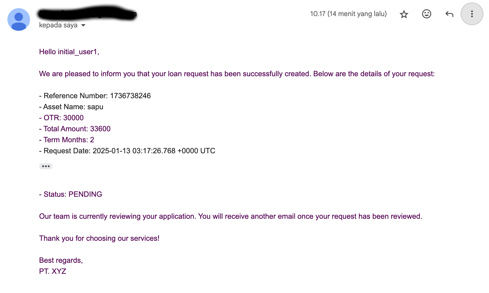

# Go Simple Loan Backend App

Welcome to the **Go Simple Loan Backend App**! This is a backend application built with Golang, designed to manage user accounts, loan requests, and administrative approvals. It includes robust authentication, API documentation, and storage integration.

---

## Features

- JWT-based Authentication & Refresh Token

- **User Management**:

  - Registration, login, and profile management.
  - Admin can update user credit limit.

- **Loan Management**:

  - Users can create loan requests.
  - Admins can view and approve loan requests.

- **Database**:

  - MySQL with GORM ORM for efficient and easy database management.

- **File Storage**:

  - Integrated with MinIO for object storage needs.

- **API Documentation**:

  - Swagger for seamless API exploration and testing.

- **Concurrent Processing**:

  - Integrated email notification system for loan-related actions:
    - Loan request creation.
    - Loan approval notification.

    **Example Email Previews**:
    - Loan Request Email Notification:
      
    - Loan Approved Email Notification:
      

---

## Security and Best Practices

This project is built with security in mind and adheres to several best practices, including those recommended by the [OWASP Top 10](https://owasp.org/www-project-top-ten/):

- **JWT Authentication**:
  - Secure authentication and session management using JSON Web Tokens (JWT), which supports access and refresh tokens for enhanced security.

- **ORM (Object Relational Mapping)**:
  - Utilizes GORM, an ORM that helps prevent SQL injection vulnerabilities by abstracting raw SQL queries.

- **Role-Based Access Control (RBAC)**:
  - Implements user roles (User and Admin) to enforce authorization and restrict access to sensitive endpoints.

---

## Prerequisites

Ensure you have the following installed on your system:

- [Docker](https://www.docker.com/) and [Docker Compose](https://docs.docker.com/compose/)

---

## Installation

1. Clone the repository:

   ```bash
   git clone https://github.com/sakku116/go-simple-loan-backend-app.git
   cd go-simple-loan-backend-app
   ```

2. Set up the environment variables: Copy the example environment file and customize it:

   ```bash
   cp .env.example .env
   ```

   Update the `.env` file with your specific configuration.

3. Deploy the application using Docker Compose:

   ```bash
   docker-compose up -d
   ```

4. Access the application at:

   ```
   http://localhost:8000
   ```

---

## API Documentation

Once the application is running, you can access the Swagger API documentation at:

```
http://localhost:8000/swagger/index.html
```
